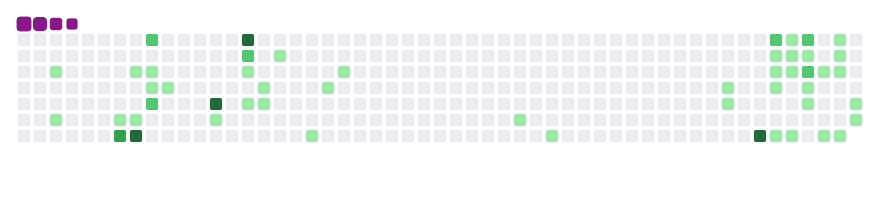

## Hi there 👋, I'm 👨‍💻 Bhanu Teja Giddaluru!

### Robotics System Engineer | AI Enthusiast | Innovator

---

### 🛠️ About Me

I've always chosen to 𝓯𝓸𝓵𝓵𝓸𝔀 𝓶𝔂 𝓱𝓮𝓪𝓻𝓽, which led me to pursue my passion for 𝐫𝐨𝐛𝐨𝐭𝐢𝐜𝐬—building machines that think and act. I will 𝓃𝑒𝓋𝑒𝓇 𝓈𝓉𝑜𝓅 seeking ways for the existence of life in the universe, break new ground, and create impactful robotic systems.

𝐓𝐡𝐞 𝐒𝐭𝐚𝐫𝐭 𝐨𝐟 𝐌𝐲 𝐑𝐨𝐛𝐨𝐭𝐢𝐜𝐬 𝐀𝐝𝐯𝐞𝐧𝐭𝐮𝐫𝐞 𝐉𝐨𝐮𝐫𝐧𝐞𝐲
- ‾‾‾‾‾‾‾‾‾‾‾‾‾‾‾‾‾‾‾‾‾‾‾‾‾‾‾‾‾‾‾‾‾‾‾‾‾‾‾‾‾‾‾‾‾‾‾‾‾‾‾‾
- 
My love for robots blossomed gradually, like a flower unfurling its petals. From childhood encounters with toys that moved and responded, to awe-inspiring films that brought machines to life, each experience deepened my fascination. Robots became my companions in exploration, sparking a curiosity about technology and endless possibilities. During high school, I built a robotic car. Even when others laughed, calling it just a remote control car, I believed in myself. I love to build rather than buy, and some of my best memories come from creating things on my own.

In the first two years of my bachelor's, I worked on various hardware projects, gaining an understanding of fundamentals like infrared sensors, proximity sensors, and LEDs. I completed around 13 projects and had the opportunity to collaborate on a mechatronics project—a Bomb Detector Rover—with senior students. This success earned me recognition, and I was elected President of my college's Robotics and Innovations Club. During this time, I mentored over 40 projects, including my final-year project: an Autonomous Drone using Deep Neural Networks.

Although I excelled at hardware, I realized I needed to improve my software skills to fulfill my goal of becoming a robotics engineer. This realization led me to pursue a master's in Artificial Intelligence. Later, I became a Teaching Assistant for both the AI course and Introduction to Intelligent Robotics, where balancing both hardware and software knowledge has been key to achieving my dream in robotics.

---

### 📊 Technical Skills

- **Programming:** Python, C, C++, Java, SQL, MATLAB, VHDL, Verilog, Assembly
- **Robotics:** ROS, SLAM, Rviz, Gazebo, CAN, LIN, UART, I2C, SPI
- **AI/ML:** TensorFlow, PyTorch, Transformers, Langchain, NLP, LLMs
- **Software Tools:** SolidWorks, Easy-EDA, OpenCV, Git, Android Studio
- **Hardware:** STM32, Jetson Nano, Raspberry Pi, Arduino, ESP32, Automotive RADAR

---

### 💎 Projects

- **Autonomous Restaurant Robot:** Developed with ROS, Nav, and SLAM achieving 95.7% path-planning accuracy. [GitHub](https://github.com/Bhanutejagiddaluru/Autonomous_Restaurant_Robot)
- **Autonomous Vehicle Pedestrian Analysis:** YOLOv9-powered behavior detection model with 92.4% accuracy. [GitHub](https://github.com/Bhanutejagiddaluru/Autonomous-Vehicle-Pedestrian-Analysis)
- **Surveillance Robot:** Designed an unmanned ground vehicle with advanced object detection and AI command loop. [GitHub](https://github.com/Bhanutejagiddaluru/Surveillance_Robot)
- **Robotic Fruit Picking:** Implemented deep learning for UAVs to identify and pluck ripe fruits.

---
<!--  -->

### 📞 Get in Touch

- ✉️ **Email:** giddalurubhanuteja@gmail.com  
- 👥 **LinkedIn:** [giddalurubhanuteja](https://www.linkedin.com/in/giddalurubhanuteja/)  
- 💻 **Portfolio:** [bhanutejagiddaluru.github.io/portfolio/](https://bhanutejagiddaluru.github.io/portfolio/)  
- 🎥 **YouTube:** [Demo Projects](https://youtu.be/R4vdIAV3kuA?si=BXMTjXRZbfZU5uIZ)

Let's collaborate and build something amazing! 🚀🤖

<picture>
  <source media="(prefers-color-scheme: dark)" srcset="https://raw.githubusercontent.com/Bhanutejagiddaluru/Bhanutejagiddaluru/output/github-snake-dark.svg" />
  <source media="(prefers-color-scheme: light)" srcset="https://raw.githubusercontent.com/Bhanutejagiddaluru/Bhanutejagiddaluru/output/github-snake.svg" />
  
</picture>
